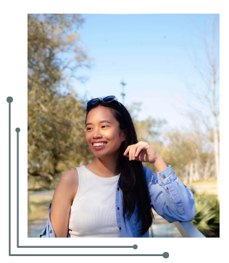

# Maea's Profile Page

This is a simple profile page about me. I am mainly using flex box for this project.

## MUST READ

This project is not done yet.

##

### What I learned:

- ```css
  .container-header {
    height: 100vh;
    background-color: #607274;
    display: flex;
    justify-content: center;
  }
  ```

  - Using `height: 100vh` for using the whole window - any desktop sizes.

- ```css
  .about-description-container {
    display: flex;
    flex-direction: column;
    justify-content: center;
    align-items: center;
    /* text-align: center; */
    flex-basis: 200px;
    margin: 0px 50px 50px 50px;

    gap: 10px;

    font-weight: 300;
  }
  ```

  - `flex-basis` acts as a height when the flex-direction is set to column.

- ```html
  
  ```
  - using CANVA

### Built with:

- Semantic HTML5 markup
- CSS custom properties
- Flexbox

### Future Update:

03/09/24:

- Skill section
- Contact section
- Sticky Navbar

## Author

- LinkedIn - [Maea Matugas](www.linkedin.com/in/maea-matugas)
- GitHub - [@hollyBelly2021](https://github.com/hollyBelly2021)
